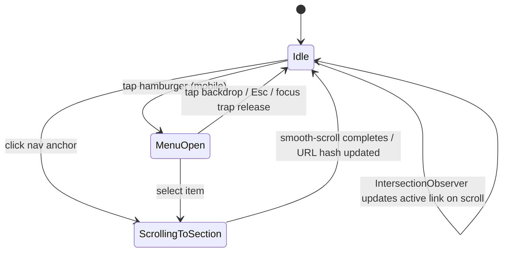
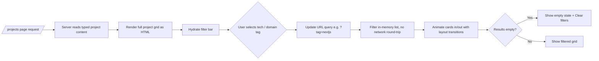
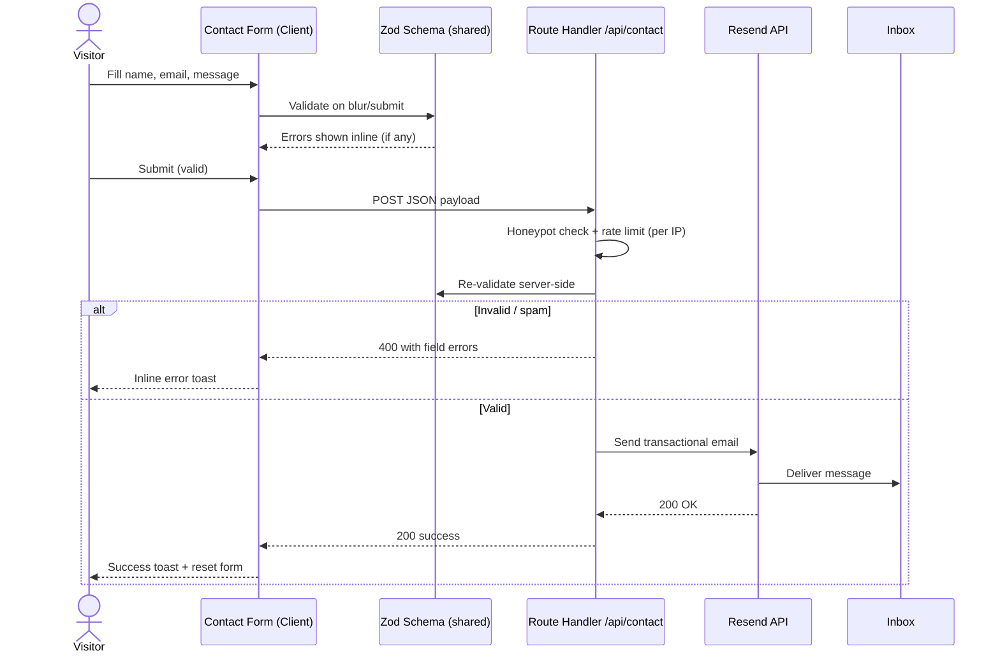
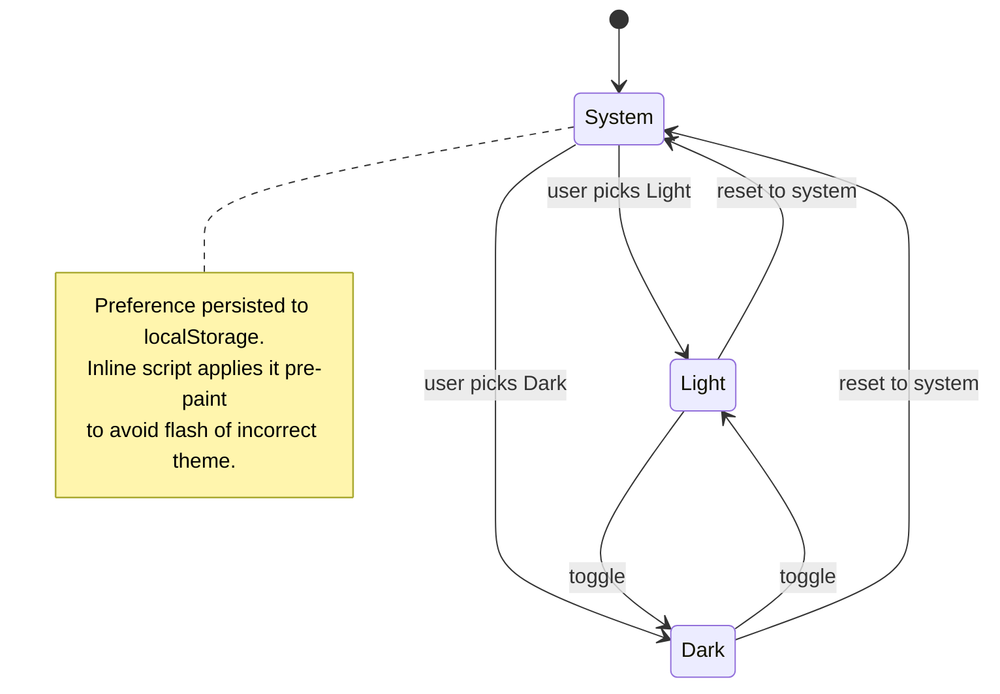
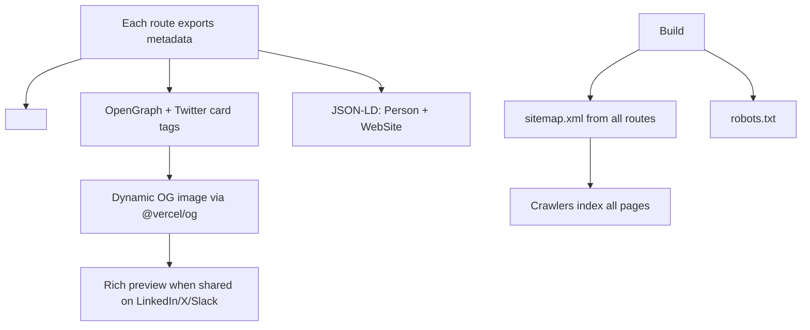
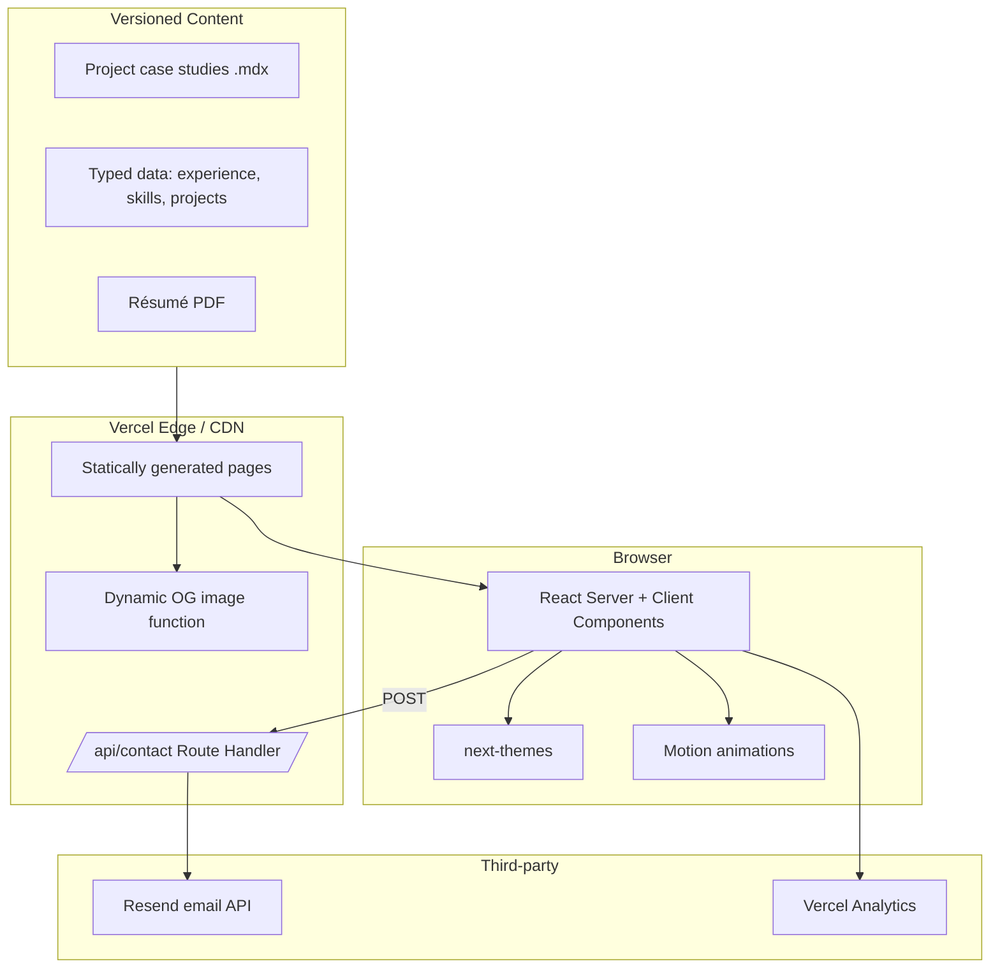
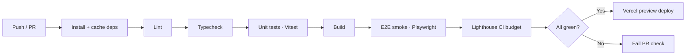

<div align="center">

# Youssef Ben Abdesselem — Developer Portfolio

**A fast, accessible, content-driven portfolio for a Full-Stack Engineer specializing in real-time, multi-tenant, and AI-powered systems.**

[](https://nextjs.org/)
[](https://www.typescriptlang.org/)
[](https://tailwindcss.com/)
[](https://vercel.com/)
[](#-license)

[**Live Site**](#) · [**Project Board (Kanban)**](https://github.com/users/BenAbdesselemYoussef/projects/1) · [**Résumé (PDF)**](./resume/Youssef_Ben_Abdesselem_Resume_2026-04-23.pdf)

</div>

---

## 📖 Table of Contents

- [About](#-about)
- [Why This Portfolio](#-why-this-portfolio)
- [Tech Stack](#-tech-stack)
- [Feature Overview](#-feature-overview)
- [Application Flows](#-application-flows)
  - [1. First Visit / Landing](#1-first-visit--landing)
  - [2. Navigation & Section Scroll](#2-navigation--section-scroll)
  - [3. Project Discovery & Filtering](#3-project-discovery--filtering)
  - [4. Project Case-Study Detail](#4-project-case-study-detail)
  - [5. Contact Form Submission](#5-contact-form-submission)
  - [6. Résumé View / Download](#6-résumé-view--download)
  - [7. Theme Toggle (Dark / Light)](#7-theme-toggle-dark--light)
  - [8. SEO, Metadata & Social Sharing](#8-seo-metadata--social-sharing)
- [Architecture](#-architecture)
- [Content Model](#-content-model)
- [Project Structure](#-project-structure)
- [Getting Started](#-getting-started)
- [Configuration](#-configuration)
- [Scripts](#-scripts)
- [Quality, Testing & CI/CD](#-quality-testing--cicd)
- [Accessibility & Performance Budgets](#-accessibility--performance-budgets)
- [Deployment](#-deployment)
- [Project Management (GitHub Kanban)](#-project-management-github-kanban)
- [Roadmap](#-roadmap)
- [Contact](#-contact)
- [License](#-license)

---

## 👋 About

I'm **Youssef Ben Abdesselem**, a Full-Stack Engineer with **4+ years** of experience building scalable, real-time, and data-driven systems — from multi-tenant SaaS platforms to tools that blend software with AI in practical ways. Recently I've focused on integrating LLMs into everyday workflows and exploring how AI can enhance decision-making.

This repository is my **personal portfolio website**: the place that tells that story. It pulls real content from my career — companies like **Planisphere Systems**, **Forvis Mazars**, **Acoba**, and **Open Eyes Consulting** — and presents selected projects as proper case studies rather than thumbnails.

> 📄 The site's "Experience" and "Résumé" content is sourced from my CV, included in this repo at
> [`./resume/Youssef_Ben_Abdesselem_Resume_2026-04-23.pdf`](./resume/Youssef_Ben_Abdesselem_Resume_2026-04-23.pdf).
> The PDF is also the canonical download served by the [Résumé flow](#6-résumé-view--download).

---

## 🎯 Why This Portfolio

A portfolio for a full-stack engineer should itself be a small but complete demonstration of craft. The goals:

| Goal | How it's met |
| --- | --- |
| **Prove front-end depth** | Server Components, streaming, animation, responsive design, dark mode, a11y. |
| **Prove full-stack reach** | A real serverless API route for the contact form (validation → email delivery). |
| **Be genuinely fast** | Static-first rendering, image optimization, near-zero client JS on content pages. |
| **Be maintainable** | Content lives in typed data files / MDX — adding a project is a one-file change. |
| **Be discoverable** | First-class SEO: per-page metadata, sitemap, robots, JSON-LD, dynamic OG images. |
| **Be measurable** | Lighthouse budgets in CI; analytics on Core Web Vitals. |

---

## 🧱 Tech Stack

Chosen to mirror the stack I work in daily and to keep the site **static-first, type-safe, and easy to extend**.

### Core
| Layer | Choice | Rationale |
| --- | --- | --- |
| **Framework** | [Next.js 15](https://nextjs.org/) (App Router, RSC) | SEO + performance via Server Components and static generation; the framework I use most. |
| **Language** | [TypeScript 5](https://www.typescriptlang.org/) | End-to-end type safety from content to UI. |
| **Styling** | [Tailwind CSS 4](https://tailwindcss.com/) | Utility-first, design-token driven, tiny production CSS. |
| **UI primitives** | [shadcn/ui](https://ui.shadcn.com/) + [Radix UI](https://www.radix-ui.com/) | Accessible, unstyled primitives I own and can theme. |
| **Animation** | [Motion](https://motion.dev/) (Framer Motion) | Scroll-linked reveals and micro-interactions, respecting reduced-motion. |
| **Icons** | [lucide-react](https://lucide.dev/) | Consistent, tree-shakeable icon set. |

### Content & Forms
| Concern | Choice | Rationale |
| --- | --- | --- |
| **Project case studies** | [MDX](https://mdxjs.com/) | Long-form content with embedded React components. |
| **Structured content** | Typed TS data modules (`/content`) | No CMS to host; content is versioned with the code and fully typed. |
| **Form handling** | [React Hook Form](https://react-hook-form.com/) + [Zod](https://zod.dev/) | Shared validation schema on client **and** server. |
| **Email delivery** | [Resend](https://resend.com/) via a Route Handler | Contact form → transactional email, no backend server to run. |
| **Theming** | [next-themes](https://github.com/pacocoursey/next-themes) | Flash-free dark/light with system preference. |

### Platform & Tooling
| Concern | Choice |
| --- | --- |
| **Hosting** | [Vercel](https://vercel.com/) (Edge network, preview deployments per PR) |
| **Analytics** | Vercel Analytics + Speed Insights (Core Web Vitals) |
| **Linting / formatting** | ESLint + Prettier |
| **Unit tests** | [Vitest](https://vitest.dev/) + Testing Library |
| **E2E tests** | [Playwright](https://playwright.dev/) |
| **CI/CD** | GitHub Actions (lint → typecheck → test → build → Lighthouse budget) |
| **Package manager** | pnpm |

> **Stack rationale in one line:** Next.js + TypeScript + Tailwind gives a static-first, SEO-friendly, type-safe foundation; the only "backend" is a single serverless route for the contact form — everything else is rendered ahead of time.

---

## ✨ Feature Overview

- **Hero** with a concise value proposition and primary CTAs (View Work · Contact · Résumé).
- **Experience timeline** generated from typed data (companies, roles, dates, impact metrics, stacks).
- **Projects grid** with **client-side filtering** by technology/domain and a **case-study detail** page per project.
- **Skills matrix** grouped as in the CV (Core Development · AI & Data · Cloud & Automation · Methodologies).
- **Contact form** with inline validation, spam honeypot, server-side re-validation, and email delivery.
- **Résumé**: inline PDF viewer + one-click download, served from the repo.
- **Dark / light theme** with system default and persisted preference.
- **Fully responsive**, keyboard-navigable, and screen-reader friendly.
- **SEO suite**: metadata, `sitemap.xml`, `robots.txt`, JSON-LD `Person`/`WebSite`, dynamic OG images.

---

## 🔁 Application Flows

> The flows below are the heart of how the app behaves. Diagrams use [Mermaid](https://mermaid.js.org/), which GitHub renders natively.

### 1. First Visit / Landing

What happens between "user clicks the link" and "user sees a fully interactive, themed page."

```mermaid
flowchart TD
    A[User requests "/"] --> B{Edge cache hit?}
    B -- Yes --> C[Serve prebuilt static HTML from CDN]
    B -- No --> D[Render React Server Components at the edge]
    D --> C
    C --> E[Inline theme script sets data-theme before paint]
    E --> F[First Contentful Paint: hero + nav, no layout shift]
    F --> G[Hydrate interactive islands: nav menu, theme toggle, motion]
    G --> H[IntersectionObserver triggers scroll-reveal sections]
    H --> I[Idle: prefetch likely routes /projects, /about]
```

**Key decisions**
- Theme is applied by a tiny inline script **before first paint** → no dark-mode flash.
- Content sections are Server Components (zero client JS); only the nav, theme toggle, and animations hydrate.
- Next.js prefetches in-viewport links when the network is idle for instant subsequent navigation.

---

### 2. Navigation & Section Scroll

Sticky header on desktop, slide-over drawer on mobile, with smooth in-page scrolling and active-section highlighting.



**Key decisions**
- Mobile menu is a focus-trapped dialog; `Esc` and backdrop click close it; body scroll locks while open.
- Active link reflects the section currently in view (IntersectionObserver), keeping the URL hash in sync for shareable deep links.
- `scroll-behavior` respects `prefers-reduced-motion`.

---

### 3. Project Discovery & Filtering

The Projects page renders the full set server-side, then filtering happens instantly on the client.



**Key decisions**
- Filters are encoded in the **URL query string** → shareable, back-button friendly, SSR-consistent.
- Filtering is pure client-side over already-loaded data (small dataset) → zero latency.
- Card enter/exit uses layout animations; respects reduced-motion by snapping instead of animating.

---

### 4. Project Case-Study Detail

Each project has its own statically generated page built from MDX + structured metadata.

```mermaid
flowchart TD
    A[Build time] --> B[generateStaticParams over all project slugs]
    B --> C[Pre-render /projects/[slug] pages]
    C --> D[Static HTML + per-project OG image]
    subgraph Runtime
      E[User opens /projects/some-slug] --> F[Serve static page from CDN]
      F --> G[Render MDX: problem, approach, architecture, outcome]
      G --> H[Embedded components: image gallery, tech badges, metrics]
      H --> I[Prev/Next project navigation]
    end
```

**Key decisions**
- All case studies are **statically generated** (`generateStaticParams`) → instant loads, perfect SEO.
- MDX lets a case study embed live components (diagrams, galleries) while staying content-first.
- Each project page emits its own metadata + OG image for rich link previews.

---

### 5. Contact Form Submission

The one true "full-stack" path: validated on the client, **re-validated and sent on the server** via a serverless Route Handler.



**Key decisions**
- **One Zod schema** is the source of truth for both client and server validation — no drift.
- **Honeypot field + per-IP rate limiting** stop the most common bot spam without a CAPTCHA.
- The server **never trusts the client**: it re-validates before calling Resend.
- Secrets (`RESEND_API_KEY`) live only on the server; the client only ever sees success/error states.

---

### 6. Résumé View / Download

```mermaid
flowchart LR
    A[User clicks "Résumé"] --> B{Action}
    B -- View --> C[Open inline PDF viewer / new tab]
    B -- Download --> D[Anchor with download attr serves the bundled PDF]
    C --> E[PDF served from /resume in repo]
    D --> E
    E --> F[Analytics event: resume_viewed / resume_downloaded]
```

**Key decisions**
- The résumé PDF is **version-controlled in the repo** (`/resume`), so the live download always matches what's committed.
- Both view and download paths fire an analytics event so I can see engagement.

---

### 7. Theme Toggle (Dark / Light)



**Key decisions**
- Default is **system preference**; an explicit choice persists across visits.
- The pre-paint inline script eliminates the dark-mode flash (FOUC).

---

### 8. SEO, Metadata & Social Sharing



**Key decisions**
- Per-route metadata + JSON-LD structured data make the site machine-readable.
- Dynamic OG images render a branded card per page/project for strong link previews.

---

## 🏗 Architecture



**Principles**
- **Static-first**: every content page is prerendered. The only dynamic server code is the contact route and OG image generation.
- **Content as code**: projects, experience, and skills are typed modules; case studies are MDX. Adding content = a PR, not a CMS login.
- **Progressive enhancement**: pages are useful as static HTML; interactivity layers on top.

---

## 🗂 Content Model

Typed content modules keep the UI dumb and the data authoritative.

```ts
// content/types.ts (illustrative)
export type Experience = {
  company: string;
  role: string;
  location?: string;
  start: string;          // ISO month, e.g. "2025-09"
  end: string | "present";
  highlights: string[];   // impact-oriented bullet points
  stack: string[];        // technologies used
};

export type Project = {
  slug: string;
  title: string;
  summary: string;
  domain: ("ai" | "saas" | "real-time" | "data" | "frontend")[];
  stack: string[];
  links?: { demo?: string; repo?: string };
  featured?: boolean;
  // long-form body lives in content/projects/<slug>.mdx
};

export type SkillGroup = {
  category: "Core Development" | "AI & Data" | "Cloud & Automation" | "Methodologies";
  items: string[];
};
```

The initial dataset is seeded from the CV (Planisphere Systems, Forvis Mazars, Acoba, Open Eyes Consulting; skills across TypeScript/JS, Python, Next.js, LLM APIs, AWS/Azure, Docker/K8s, CI/CD).

---

## 📁 Project Structure

```
portfolio2/
├─ app/
│  ├─ (site)/
│  │  ├─ page.tsx              # Home (hero, featured work, skills, experience, contact CTA)
│  │  ├─ about/page.tsx
│  │  ├─ projects/
│  │  │  ├─ page.tsx           # Filterable grid
│  │  │  └─ [slug]/page.tsx    # Case-study detail (static)
│  │  └─ resume/page.tsx       # Inline viewer + download
│  ├─ api/
│  │  └─ contact/route.ts      # Serverless form handler (Zod + Resend)
│  ├─ opengraph-image.tsx      # Dynamic OG image
│  ├─ sitemap.ts
│  ├─ robots.ts
│  └─ layout.tsx               # Root layout, theme provider, fonts, JSON-LD
├─ components/
│  ├─ ui/                      # shadcn/ui primitives
│  ├─ sections/                # Hero, ExperienceTimeline, SkillsMatrix, ProjectGrid, ContactForm
│  └─ common/                  # Nav, ThemeToggle, Footer, MotionReveal
├─ content/
│  ├─ experience.ts
│  ├─ skills.ts
│  ├─ projects.ts
│  └─ projects/*.mdx           # One case study per project
├─ lib/                        # validation (zod schemas), seo, analytics, utils
├─ resume/                     # Résumé PDF (served + downloadable)
├─ public/                     # Static assets, favicons
├─ tests/                      # Vitest unit + Playwright e2e
├─ .github/workflows/ci.yml
└─ README.md
```

---

## 🚀 Getting Started

### Prerequisites
- **Node.js ≥ 20** (this repo uses [fnm](https://github.com/Schniz/fnm) locally)
- **pnpm** (`npm i -g pnpm`)

### Setup

```bash
# 1. Clone
git clone https://github.com/BenAbdesselemYoussef/portfolio2.git
cd portfolio2

# 2. Install dependencies
pnpm install

# 3. Configure environment
cp .env.example .env.local
# fill in the values described below

# 4. Run the dev server
pnpm dev
# → http://localhost:3000
```

---

## ⚙️ Configuration

Environment variables (see `.env.example`):

| Variable | Required | Description |
| --- | --- | --- |
| `RESEND_API_KEY` | Yes (for contact form) | Server-side API key for sending email via Resend. |
| `CONTACT_TO_EMAIL` | Yes | Destination inbox for contact submissions. |
| `NEXT_PUBLIC_SITE_URL` | Yes | Canonical site URL, used for SEO, sitemap, and OG images. |

> All secrets are server-only. Anything exposed to the browser is explicitly prefixed `NEXT_PUBLIC_`.

---

## 📜 Scripts

| Command | Description |
| --- | --- |
| `pnpm dev` | Start the dev server with hot reload. |
| `pnpm build` | Production build (static generation). |
| `pnpm start` | Serve the production build locally. |
| `pnpm lint` | ESLint. |
| `pnpm typecheck` | `tsc --noEmit`. |
| `pnpm test` | Vitest unit tests. |
| `pnpm test:e2e` | Playwright end-to-end tests. |
| `pnpm format` | Prettier. |

---

## ✅ Quality, Testing & CI/CD

A GitHub Actions pipeline runs on every push / PR:



- **Unit**: content schema validation, utilities, form logic.
- **E2E**: landing render, navigation, project filtering, contact form happy/error paths.
- **Lighthouse budget**: PR fails if performance/a11y/SEO regress past thresholds.

---

## ♿ Accessibility & Performance Budgets

| Metric | Target |
| --- | --- |
| Lighthouse Performance | ≥ 95 |
| Lighthouse Accessibility | 100 |
| Lighthouse SEO | 100 |
| Largest Contentful Paint | < 1.5s (fast 4G) |
| Cumulative Layout Shift | < 0.05 |
| Total Blocking Time | < 150ms |

Accessibility commitments: semantic landmarks, visible focus states, full keyboard operability, `prefers-reduced-motion` support, and AA color contrast in both themes.

---

## ☁️ Deployment

- **Host:** Vercel, connected to this GitHub repo.
- **Previews:** every PR gets an isolated preview URL (great for reviewing flows in context).
- **Production:** merges to `main` deploy automatically.
- **Env vars:** configured in the Vercel dashboard (mirroring `.env.example`).

---

## 📌 Project Management (GitHub Kanban)

Work on this site is tracked on a GitHub Projects board:

➡️ **[github.com/users/BenAbdesselemYoussef/projects/1](https://github.com/users/BenAbdesselemYoussef/projects/1)**

The board follows a simple flow:

```
Backlog  →  To Do  →  In Progress  →  In Review  →  Done
```

Each feature/flow above maps to one or more issues, grouped by milestone (Foundation → Content → Flows → Polish → Launch). The README's [Roadmap](#-roadmap) is the high-level view; the board is the live status.

---

## 🗺 Roadmap

- [ ] **M1 — Foundation**: Next.js + TS + Tailwind scaffold, theming, layout, nav, CI.
- [ ] **M2 — Content**: experience timeline, skills matrix, projects data + MDX case studies (seeded from CV).
- [ ] **M3 — Flows**: project filtering, contact form + Resend route, résumé view/download.
- [ ] **M4 — Polish**: animations, OG images, SEO suite, Lighthouse budgets, a11y pass.
- [ ] **M5 — Launch**: custom domain, analytics, final QA, production deploy.

---

## 📬 Contact

**Youssef Ben Abdesselem** — Full-Stack Developer

- ✉️ youssefbenabdesselem@gmail.com
- 📞 +216 55 593 006
- 🐙 GitHub: [BenAbdesselemYoussef](https://github.com/BenAbdesselemYoussef)
- 💼 LinkedIn: youssef ben abdesselem
- 📄 [Résumé (PDF)](./resume/Youssef_Ben_Abdesselem_Resume_2026-04-23.pdf)

---

## 📄 License

Released under the [MIT License](#-license). The résumé and personal content are © Youssef Ben Abdesselem.
